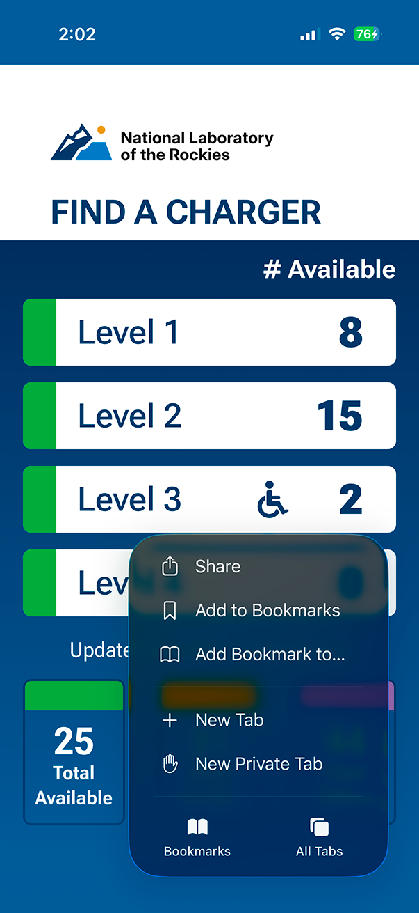
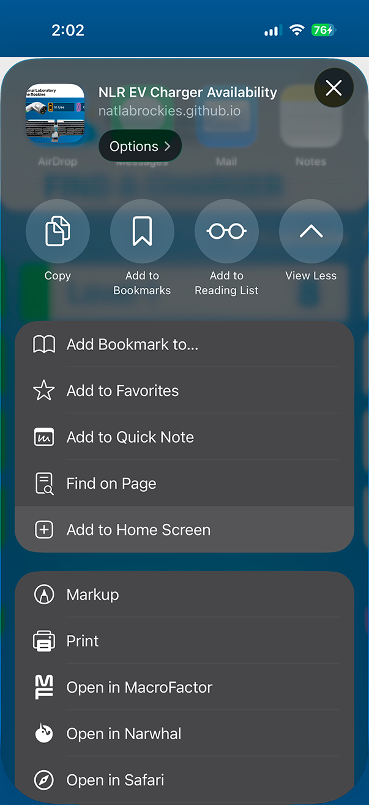
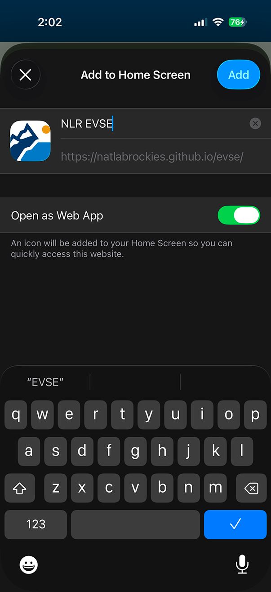
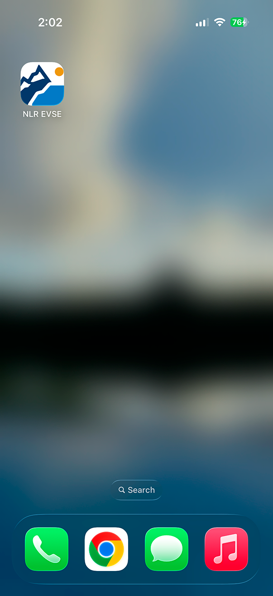
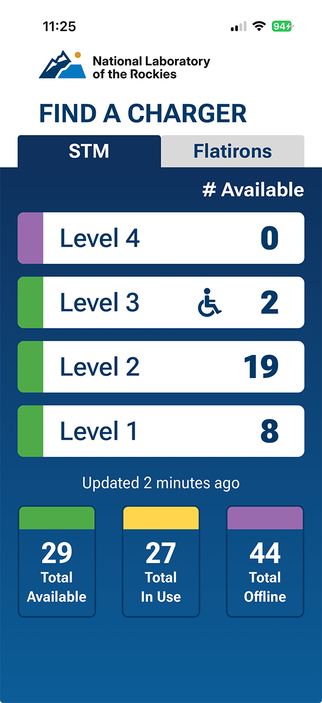

# NLR EVSE Dashboard

Real-time EV charger availability for the National Laboratory of the Rockies:

## Run

Run the Angular interface at `http://localhost:4200`:

```shell
pnpm install
pnpm start
```

## Functionality

The Angular 22/Tailwind 4 interface:

- Queries EVSE data every 60 seconds and shows availability for garage levels 1–4.
- Summarizes available, in-use, and offline chargers; an online `Ready` charger is available.
- Shows accessible charging, loading/error states, and the relative last-update time.
- Provides a responsive, production service-worker-enabled interface.

## Development

```shell
pnpm format
pnpm lint
pnpm test
pnpm build
```

## Add to the iOS Home Screen

1. Open the dashboard in Safari and tap **Share**.

   

2. Tap **Add to Home Screen**.

   

3. Leave **Open as Web App** enabled and tap **Add**.

   

4. Open **NLR EVSE** from the Home Screen.

   

   
